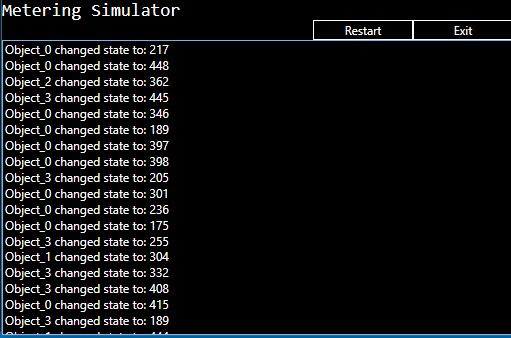
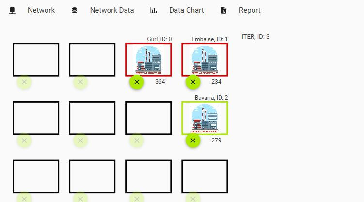
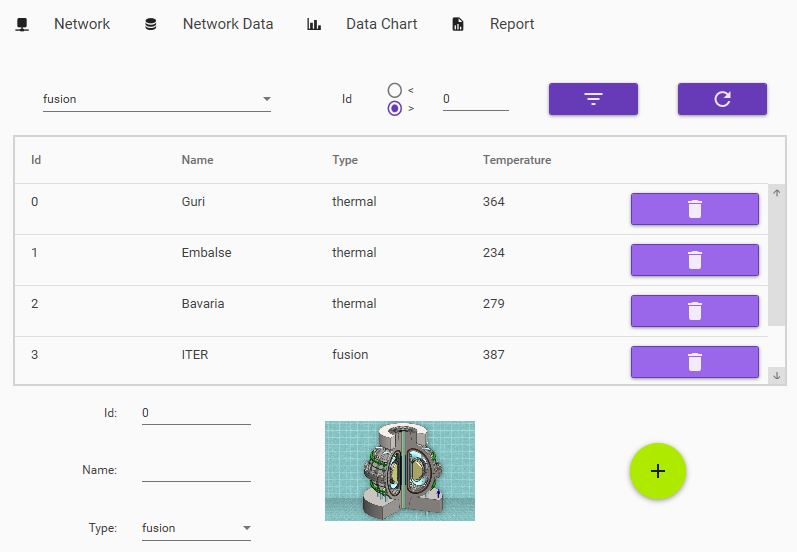
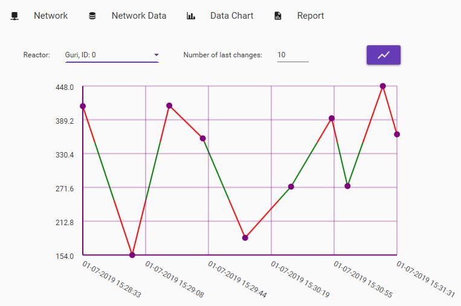
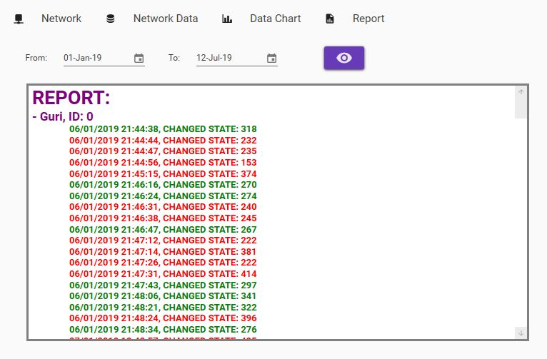

# Power Plant Metering Application

School project from Human Computer Interaction course in Applied Software Engineering department (Faculty of Technical Sciences Novi Sad).

## Table of Contents

- [Getting Started](#Getting-Started)
- [MeteringSimulator](#Metering-Simulator)
- [PZ3-NetworkService](#PZ3-NetworkService)
  - [Network](#Network)
  - [Network Data](#Network-Data)
  - [Data Chart](#Data-Chart)
  - [Report](#Report)

## Getting Started

To start application:

1. Build solution
1. (Optional) Set solution to multiple startup projects ( *Right Click Solution > Properties > Multiple Startup Perojects*) where `PZ3-NetworkService` project will be loaded first and then `MeteringSimulator`
1. Run solution

> This project is made using WPF and .NET Framework 4.6.1

## Metering Simulator

Goald of metering simulator is to simulate data from the field. In case of this project it simulates temperatures from reactor plants.

How it works:

1. Asks `PZ3-NetworkService` for number of reactor plants at the start of it's life
1. Periodically sends data to `PZ3-NetworkService` in form `"Objekat_" + rInt + ":" + value`. Where `rInt` is random number / power plant index.

## PZ3-NetworkService

Main goal of this app is to support visualization of data aquired from the `MeteringSimulator` as well as to alert user when power plant reaches critical temperature.

### Network

This View is composed of two parts.
Grid of tracked reactors, and list of reactors.
If user wants to track an reactor he can drag and drop it to desired location in grid. If temperature is critical it will have red border, if not then it will have green border.

### Network Data

Here user can register an reactor, delete it from the list, also he can filter them by reactor type and/or id.

### Data Chart

Provides the ability for user to see how reactor temperature changed over time. Essentially it takes data from log file and visualizes it.

### Report

Displays log file in an user friendly way.

